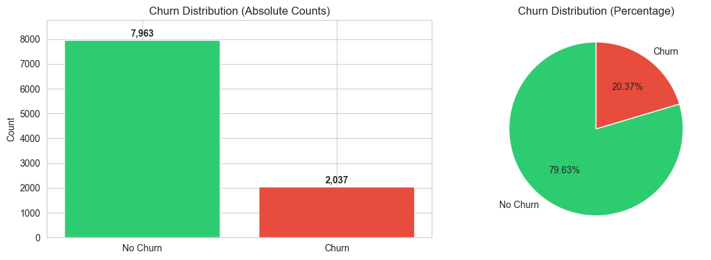

# Churn Prediction
---

## Executive summary
The churn dataset is highly imbalanced: with 20.37% of staff churn vs 79.63% No churn, giving an imbalance ratio ≈ 3.9:1. Gradient Boosting (GB) model achieved the best precision (0.73) and accuracy (0.86), but low recall (0.50). Conversely, Decision tree (DT) achieved high recall (0.80) and accuracy (0.75), but poor precision (0.45), indicating a trade-off between avoiding false positives (GB) and capturing staff with the most likelihood to churn (DT). Features with the strongest linear correlation with churn were:  
* Age
* Geography_Germany
* Balance  

Hyperparameter tuning improved some models but not others, depending on the scoring critera used. The feature engineering performed appeared to impact most of the models negatively. This may be due to data leaks or noise introduced. This will be revisit in future works.

---

## Table of contents  
[Project Goal](#project-goal)  
[Data and preprocessing](#data-and-preprocessing)  
[Highlighted results from EDA](#highlighted-results-from-eda)    
[Results from Model Evaluation](#results-from-model-evaluation)   
[Conclusion](#conclusion) 

---

## Project Goal
To develop a model for predicting staff churn. Understanding churn rate could also reveal the amount of revenue lost due to the churn.

---

## Data and preprocessing
* Dataset shape (10000, 14)
* Target: 'Churn'
* No null or Duplicate values found
* Outliers handled using the IQR method

---

## Highlighted results from EDA

### 1. Distribution of Promotions
* No Churn (0): 7,963 (79.63%)
* Churn (1):    2,037 (20.37%)
> [!NOTE]
> **Imbalance ratio: ~ 3.9 : 1**



### 2. Top Features with Strongest Correlation with Churn
The following features showed the strongest linear relationship with churn, suggesting they may be key predictors for the target
```
Age                  0.358888
Geography_Germany    0.172718
Balance              0.116932
Gender_Female        0.106843
EstimatedSalary      0.011120
HasCrCard           -0.007369
Tenure              -0.013832
CreditScore         -0.025456
NumOfProducts       -0.050396
Geography_Spain     -0.053516
Geography_France    -0.103705
Gender_Male         -0.106843
IsActiveMember      -0.144331
```

## Results from Model Evaluation
* Scaler: StandardScaler
* Models trained and compared:
    - Logistic Regression
    - Decision Tree
    - Random Forest
    - Gradient Boosting
    - KNN (SMOTE)
    - SVC

* Models comparison based on selected Metrics showed Gradient Boosting achieved the best precision (0.73) and accuracy (0.86), but low recall (0.50). Conversely, Decision tree achieved high recall (0.80) and accuracy (0.75), but poor precision (0.45):
```
 Accuracy   Recall  Precision  F1-Score  AUC-ROC          Confusion Metrix               Model
 0.740280 0.751232   0.432624  0.549055 0.809764 [[1123, 400], [101, 305]] Logistic Regression
 0.749093 0.800493   0.446429  0.573192 0.847476  [[1120, 403], [81, 325]]       Decision Tree
 0.808709 0.733990   0.533095  0.617617 0.860887 [[1262, 261], [108, 298]]       Random Forest
 0.856402 0.497537   0.734545  0.593245 0.862580  [[1450, 73], [204, 202]]   Gradient Boosting
 0.746501 0.652709   0.432300  0.520118 0.762604 [[1175, 348], [141, 265]]         KNN (SMOTE)
 0.796267 0.736453   0.511111  0.603431 0.847471 [[1237, 286], [107, 299]]                 SVC
```

* Hyperparameter tuning with GridSearchCV appeared to improve the performance of some models and not others, depending on the scoring criteria chosen.
* Feature engineering was performed, generating the following columns/information
    - Balance - Salary ratio
    - Number of products per year/tenure
    - Age bins 
    - Credit score bins
*  Further model evaluation on the engineered features revealed a decline in model performance. This may be due to data leaks or noise introduction during engineering.

---

## Conclusion 
The initial datatset revealed a 20.37% churn. Models comparison reveal Gradient Boosting model (having the highest precision = 0.73) could achieve higher positive predictions, while Decision tree model (with the highest recall = 0.80) would catch more likelihood of churn. Hyperparameter tuning improved some models but not others, depending on the scoring critera used.